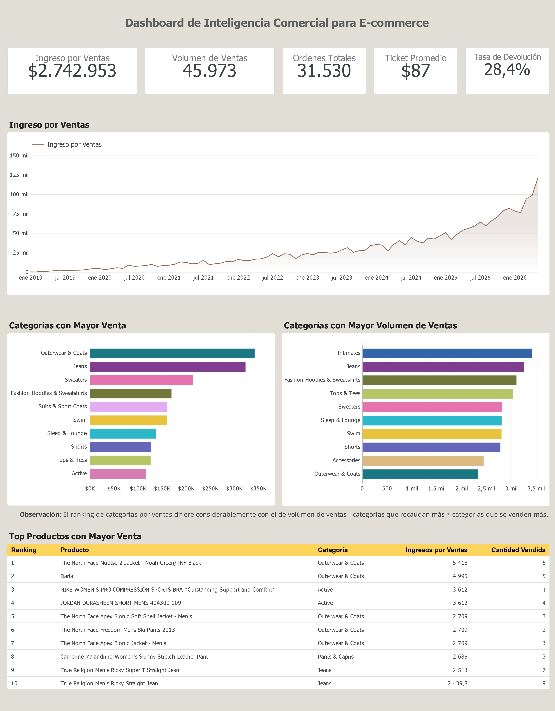
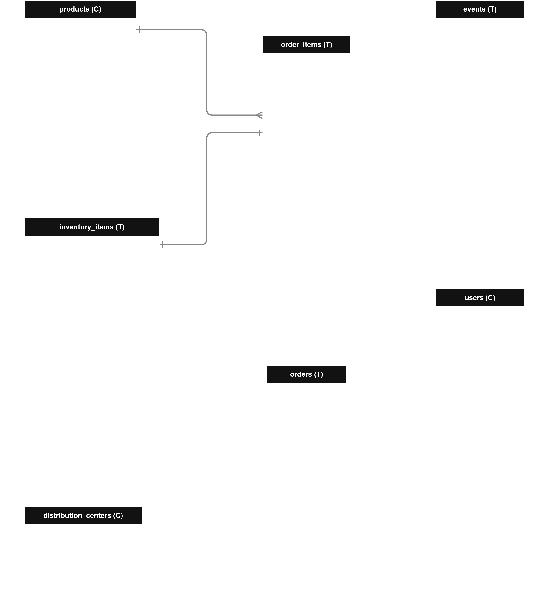

# Análisis Comercial BI en E-commerce — BigQuery + Looker Studio

Este es un proyecto de análisis de datos sobre el dataset público `thelook_ecommerce` de BigQuery. Se construyeron 5 KPIs de negocio para una tienda de e-commerce ficticia (ventas por categoría, tasa de devolución, top de productos, evolución mensual de ingresos y ticket promedio), documentando el proceso completo: modelado del esquema, decisiones de negocio detrás de cada métrica, y validaciones sobre los resultados.

El objetivo del proyecto es documentar la evidencia de proceso analítico de datos para la construcción del resultado final obtenido: un dashboard sintetizado con los datos relevantes de negocio.

## Resultados

### Construcción en BigQuery

Cada uno de los 5 KPIs se implementó como una vista (`VIEW`) independiente dentro de un dataset propio en BigQuery (`portafolio_ecommerce`), en vez de resolverse como consultas sueltas o tablas estáticas. Esta metodología presenta dos ventajas concretas: los resultados se **actualizan automáticamente** cada vez que Looker Studio consulta la vista, sin necesidad de recalcular ni exportar datos manualmente; y la lógica de cada KPI queda **centralizada y replicable** — cualquier corrección a una definición de negocio (por ejemplo, qué estados cuentan como venta válida) se aplica una sola vez en la vista, y se propaga automáticamente a cualquier reporte conectado a ella, sin duplicar código entre el dashboard y el análisis.

Las queries fuente de cada vista están versionadas en este repositorio (carpeta raíz, un archivo `.sql` por KPI), de modo que la definición de negocio detrás de cada vista queda documentada y auditable de forma independiente a BigQuery.

### Dashboard Resultante

[Ver dashboard en Looker Studio](https://datastudio.google.com/reporting/052a9015-d896-473d-bdc7-15ce6bed9808)



### Observaciones Clave

El Dashboard analítico considera 4 segmentos principales, ordenados desde la parte superior a la inferior: **datos generales clave**, **evolución mensual de los ingresos por ventas**, **rankings de categorías** y **top productos con mayor venta**. A partir de ellos se concluye:

1. **Sobre Datos Claves Generales**:

   - El comercio registra más de 45 mil unidades vendidas y 31 mil órdenes completadas a lo largo de los 6 años que cubre el dataset, reflejando un volumen consistente con una operación de escala considerable dentro del contexto simulado
   - El ticket promedio de $87 surge de dividir el ingreso total entre las órdenes completadas, reflejando que cada compra suele incluir más de un producto; el volumen de ítems vendidos supera en un 46% al número de órden. Sin un valor de referencia externo de la industria, no es posible calificar este número como alto o bajo en términos absolutos, aunque sirve como línea base para monitorear su evolución en futuros períodos.
   - La tasa de devolución promedio general es relativamente alta: más de un cuarto de los productos ordenados se está devolviendo - conviene realizar un análisis más exhaustivo de control para conocer qué productos y en qué periodos se están produciendo las devoluciones para poder indagar en las razones.
2. **Evolución Mensual del Ingreso por Ventas**:

   - El ingreso muestra una tendencia de crecimiento sostenido a lo largo de todo el período de estudio, acelerándose notablemente hacia los meses más recientes. Esta aceleración resulta ser consistente con el patrón simulado en el dataset sintético, que simula un comercio en expansión desde su origen, por lo que no se interpreta como una señal de un evento de negocio puntual - será conveniente como trabajo futuro contrastar este crecimiento con el volumen de órdenes y el costo asociado a cada una, para poder así diferenciar entre crecimiento en ingresos y crecimiento en rentabilidad.
3. **Ranking de categorías**

   - Se puede observar una clara discrepancia entre aquellas categorías que recaudan mayores ingresos en ventas y aquellas que se venden en mayor cantidad - existen productos de mayor precio que están representando gran parte de los ingresos independiente de que no sean los que más se venden.
4. **Top de productos**

   - Se puede observar que los 2 productos con mayor ingreso en ventas coinciden con la categoría más exitosa.

#### Propuestas de Trabajo Futuro

Ante las observaciones se propone que;

- Hacer un análisis agregado por periodo de cada una de las métricas analizadas para hacer un contraste por periodo - ¿La tasa de devolución siempre ha sido alta o hay periodos que empeoran el rendimiento? ¿El volumen tendría comportamiento estacional?, etc.
- Hacer un análisis de tasa de devolución por categoría/producto en busca de mayores indicios que expliquen este valor.
- Contrastar los datos de ingresos con los datos de costo en inventario + compra para obtener datos de ganancia efectiva en el comercio.
- Obtener un indicador de `ingreso por venta`/ `ingreso total` para productos/categorías para hacer un análisis representativo de la proporción del ingreso que representan cada producto.

## Dataset y arquitectura

- **Fuente**: `bigquery-public-data.thelook_ecommerce`
- **Motor**: Google BigQuery (modo sandbox, sin billing)
- **Visualización**: Looker Studio
- **Flujo**: cada archivo `.sql` de este repo corresponde a una vista (`VIEW`) creada en un proyecto propio de BigQuery, bajo el dataset `portafolio_ecommerce`. Looker Studio se conecta directamente a esas vistas, no a los archivos locales.

### Diagrama E-R



### Diccionario de Datos

Para la construcción de los 5 KPIs se utilizaron solo las tablas `products`, `order_items` y `orders`:

**Tabla `products`**

| Campo                            | Tipo              | Descripción                                                                                                           |
| -------------------------------- | ----------------- | ---------------------------------------------------------------------------------------------------------------------- |
| **id**                     | **INTEGER** | **PK - Nro Identificador**                                                                                       |
| cost                             | FLOAT             | Costo del producto                                                                                                     |
| category                         | STRING            | Categoría del producto - 26 categorías de prendas                                                                    |
| name                             | STRING            | Nombre del producto                                                                                                    |
| brand                            | STRING            | Marca del producto                                                                                                     |
| retail_price                     | FLOAT             | Precio del producto en venta                                                                                           |
| department                       | STRING            | Departamento en tienda -`Women`, `Men`                                                                             |
| sku                              | STRING            | Código de inventario del producto                                                                                     |
| **distribution_center_id** | INTEGER           | **FK** → `distribution_centers.id` - Identificador del centro de distribución donde se localiza el producto. |

**Tabla `order_items`**

| Nombre del campo            | Tipo              | Descripción                                                                               |
| --------------------------- | ----------------- | ------------------------------------------------------------------------------------------ |
| **id**                | **INTEGER** | **PK - Nro Identificador**                                                           |
| **order_id**          | INTEGER           | **FK** → `orders.id`                                                              |
| **user_id**           | INTEGER           | **FK** → `users.id`                                                               |
| **product_id**        | INTEGER           | **FK** → `products.id`                                                            |
| **inventory_item_id** | INTEGER           | **FK** → `inventory_items.id`                                                     |
| status                      | STRING            | Estado de la orden -`Shipped`, `Cancelled`, `Complete`, `Processing`, `Returned` |
| created_at                  | TIMESTAMP         | Fecha de creación de la orden - Tipo`AAAA-MM-DD HH:MM:SS UTC`                           |
| shipped_at                  | TIMESTAMP         | Fecha de envío de la orden - Tipo`AAAA-MM-DD HH:MM:SS UTC`                              |
| delivered_at                | TIMESTAMP         | Fecha de envío de entrega de la orden - Tipo`AAAA-MM-DD HH:MM:SS UTC`                   |
| returned_at                 | TIMESTAMP         | Fecha de reembolso de la orden - Tipo`AAAA-MM-DD HH:MM:SS UTC`                           |
| sale_price                  | FLOAT             | Precio de venta de la orden                                                                |

**Tabla `orders`**

| Campo              | Tipo              | Descripción                                                                               |
| ------------------ | ----------------- | ------------------------------------------------------------------------------------------ |
| **order_id** | **INTEGER** | **PK** - Nro Identificador del pedido                                                |
| **user_id**  | **INTEGER** | **FK** → `users.id`                                                               |
| status             | STRING            | Estado del pedido (`Shipped`, `Complete`, `Processing`, `Cancelled`, `Returned`) |
| gender             | STRING            | Género asociado al pedido (C. Denormalizado →`users.gender`)                           |
| created_at         | TIMESTAMP         | Fecha de creación del pedido - Tipo`AAAA-MM-DD HH:MM:SS UTC`                            |
| returned_at        | TIMESTAMP         | Fecha de devolución del pedido, si aplica - Tipo`AAAA-MM-DD HH:MM:SS UTC`               |
| shipped_at         | TIMESTAMP         | Fecha de envío del pedido, si aplica - Tipo`AAAA-MM-DD HH:MM:SS UTC`                    |
| delivered_at       | TIMESTAMP         | Fecha de entrega del pedido, si aplica - Tipo`AAAA-MM-DD HH:MM:SS UTC`                   |
| num_of_item        | INTEGER           | Cantidad de ítems distintos incluidos en el pedido                                        |

### Decisiones de Datos Clave

- **Venta válida**: se considera únicamente `status = 'Complete'` como venta concretada. Estados como `Shipped`, `Processing` y `Cancelled` no representan un resultado final confiable y quedan excluidos de los cálculos de ingreso y volumen.
- **Tasa de devolución**: calculada como `Returned / (Returned + Complete)`, definición conservadora que excluye pedidos en estados intermedios (`Shipped`, `Processing`) por no ser comparables a un resultado definitivo.
- **Fuente de categoría de producto**: se usa `products.category` como fuente única, evitando el campo `inventory_items.product_category` denormalizado.
- **Ticket promedio**: calculado por pedido completo (`SUM` de líneas por `order_id`, luego promediado), no por línea de producto individual — refleja el gasto real por transacción.
- **Evolución mensual**: excluye el mes en curso, al tratarse de un mes incompleto que distorsiona la tendencia (ver `tests.sql` para el detalle de esta validación).
- **Uso de fechas**: para el cálculo agregado por mes, se utilizó la fecha de `created_at` asumiendo que en esa fecha se recibió efectivamente el ingreso de la venta.
- **Moneda**: Como unidad monetaria se utiliza el USD al tratarse del estándar utilizado en el dataset.

## Estructura del repositorio

```
1-Ventas_por_categoria.sql     KPI 1 — Ventas y ranking por categoría
2-Tasa_de_devolucion.sql       KPI 2 — Tasa de devolución por producto/categoría
3-Top_Productos.sql            KPI 3 — Top 100 productos por recaudación
4-Evolución_mensual.sql        KPI 4 — Evolución mensual del ingreso por ventas
5-Ticket_promedio.sql          KPI 5 — Ticket promedio por pedido
tests.sql                      Chequeos de validación de datos (anomalías, cuadre de totales)
media/                         Diagrama ER y captura del dashboard
```

## Reproducción del proyecto

Para ejecutar los archivos en tu proyecto de BigQuery deberás:

1. Crear un proyecto en Google Cloud (sandbox, sin billing requerido).
2. Guardar cada KPI como una vista dentro de tu proyecto ejecutando cada archivo como `CREATE OR REPLACE VIEW` dentro de un dataset propio (ej. `portafolio_ecommerce`).
3. Conectar Looker Studio a las vistas resultantes.

> **Nota**: El archivo `tests.sql` usa `TU_PROJECT_ID` como placeholder donde corresponde referenciar el proyecto propio de GCP para testear las vistas creadas.

### Ejemplo de Creación de Vista

**Caso de ejemplo**: Para generar la vista del archivo `5-Ticket_promedio.sql`:

```SQL
CREATE OR REPLACE VIEW `TU_PROJECT_ID.NOMBRE_DATASET.kpi_ticket_promedio` AS
(
-- KPI 5: Ticket Promedio
  WITH ticket_por_pedido AS (
    SELECT order_id,
      SUM(sale_price) AS total_pedido
    FROM `bigquery-public-data.thelook_ecommerce.order_items`
    WHERE status = 'Complete'
    GROUP BY order_id
  )
  SELECT COUNT(*) AS total_ordenes,
    SUM(total_pedido) AS ventas_total,
    ROUND(AVG(total_pedido), 2) AS ticket_promedio
  FROM ticket_por_pedido
);
```

- En este caso el archivo se guardó como `ViewBuilder-KPI_ticket_promedio.sql` dentro del proyecto en *BigQuery* para poder modificar la vista en caso de ser necesario.

## Estado del proyecto

Primera versión funcional, con los 5 KPIs definidos y un dashboard de una página. Quedan pendientes como mejoras futuras:

- Revisión de casos puntuales de datos (nombres de producto incompletos en el top).
- Agregación mensual para cada KPI.
- Análisis de datos profundizado (análisis de distribuciones, comportamientos por periodo, etc).

# Autor

Para consultas, feedback o colaboración, siéntase libre de contactarme:

- **Author**: Gabriel Burgos Sobarzo | Ingeniero Civil Industrial - Universidad de Concepción. Concepción, Chile.
- **Email**: gburgos.eliseo@gmail.com
- **LinkedIn**: [www.linkedin.com/in/gabriel-bsobarzo](www.linkedin.com/in/gabriel-bsobarzo)
- **GitHub**: [https://github.com/GabrielBurgosS](https://github.com/GabrielBurgosS)

> 📣 Estoy abierto a feedback, contribuciones y colaboraciones con el proyecto, así como a colaborar en discusiones y proyectos relacionadas a BI, análisis de datos y/o IA aplicada en ingeniería 😁.
